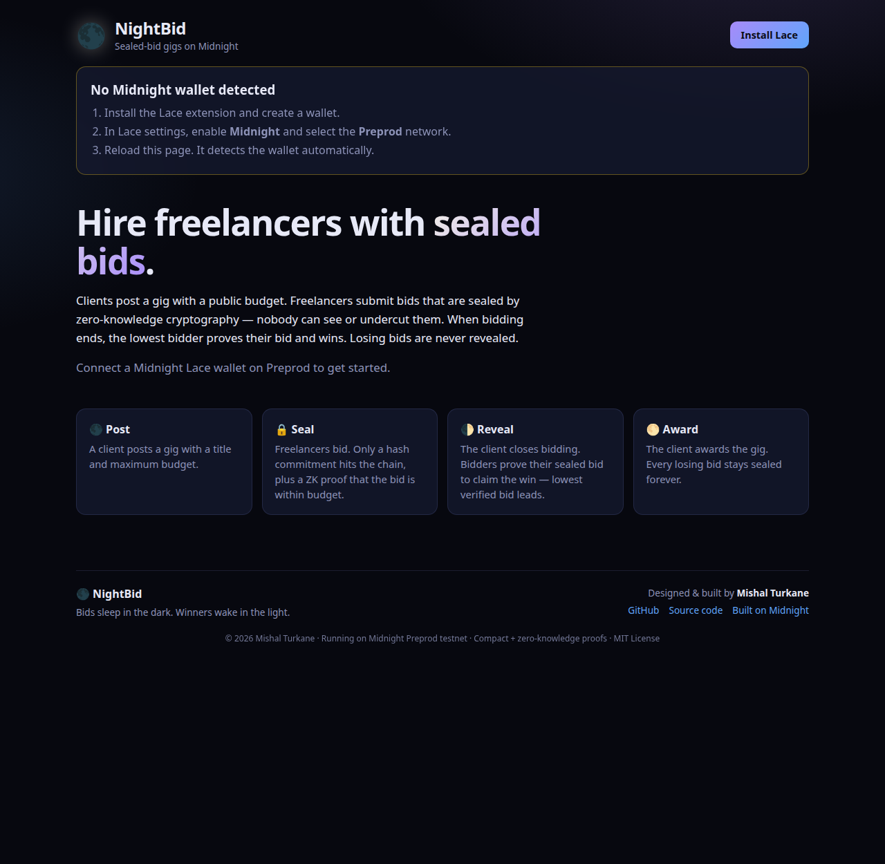
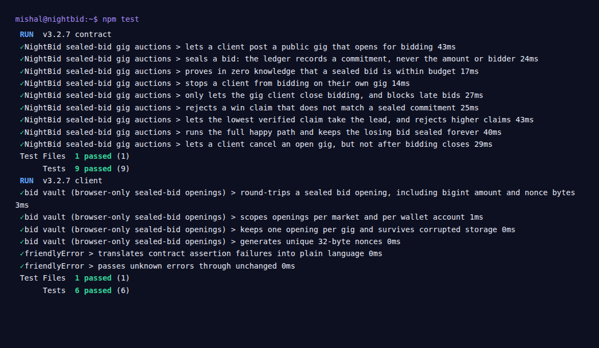

# 🌑 NightBid

**Sealed-bid gig auctions on Midnight.** *Bids sleep in the dark. Winners wake in the light.*

[](https://github.com/mishaldotrs/NightBid/actions/workflows/ci.yml)


Clients post a gig with a public budget. Freelancers submit bids that are **sealed with zero-knowledge proofs**: nobody (not competitors, not the client, not chain observers) can see a bid's amount or who placed it. When bidding closes, the lowest bidder proves their bid matches their sealed commitment and wins. **Losing bids are never revealed.**

> Built for Rise In × Midnight: *New Moon to Full*, **Level 3 (First Quarter)**.
> Idea track: **Sealed-Bid Auction** (private bids, verifiable winner).

| | |
|---|---|
| 🔗 **Live demo** | **[mishaldotrs.github.io/NightBid](https://mishaldotrs.github.io/NightBid/)** |
| 📜 **Contract (Preprod)** | _add your deployed contract address here_ |
| 🎬 **Demo video** | _add your 1-minute video link here_ |
| 👨‍💻 **Developer** | [@mishaldotrs](https://github.com/mishaldotrs) |



---

## Why sealed bids?

In an open bidding marketplace every bid is public. That leads to three problems:

- **Undercutting.** Latecomers bid $1 below the current lowest bid, so pricing becomes a race to the bottom.
- **Price discovery leaks.** Competitors learn each other's rates.
- **Collusion.** Visible bids make it easy to coordinate.

A sealed-bid auction fixes all three, but classic sealed bids need a trusted auctioneer to hold the envelopes. **NightBid replaces the auctioneer with Midnight's ZK circuits:** the envelope is a hash commitment on-chain, and a zero-knowledge proof guarantees it holds a valid bid without opening it.

## How it works

```
 🌑 Post           🔒 Seal                   🌓 Reveal                    🌕 Award
 client posts  →   freelancers place     →   client closes bidding;   →  client awards the
 title + budget    sealed bids (hash +       bidders prove their bid      gig to the lowest
 (public)          ZK proof "0 < bid ≤       matches their commitment;    verified bid. Losers
                   budget")                  lowest verified claim leads  stay sealed forever.
```

**Gig lifecycle:** `open → bidding_closed → awarded`. A gig can also go `open → cancelled`.

## 🔐 Privacy model

NightBid follows the Midnight principle of **selective disclosure**: every value that reaches the public ledger is explicitly marked with `disclose(...)` in the Compact source, and the compiler rejects any accidental leak of private (witness) data.

### What an observer CAN learn

| Public data | Why it's public |
|---|---|
| Gig title, budget, status | A job posting must be readable to attract bidders |
| The client's NightBid ID (a hash of their secret key) | So the contract can enforce "only the client may close, award or cancel" |
| **That** a bid was placed, and the bid count per gig | Needed for the auction to be verifiable. Bidders don't learn each other's amounts |
| A 32-byte commitment per bid: `persistentHash(gigId, amount, nonce, bidderId)` | The sealed envelope, which binds the bidder to their bid |
| After bidding closes: the amounts and IDs of bidders who **voluntarily claim** the win | The winner must be publicly verifiable |
| Timing and fee payment of transactions (network-level metadata) | Inherent to submitting any transaction |

### What an observer CANNOT learn

| Private data | How it stays private |
|---|---|
| **Bid amounts** | They are private circuit inputs. Only the hash commitment is disclosed, and the random 32-byte nonce makes brute-forcing small amounts infeasible |
| **Who placed each bid** | The bidder ID sits inside the hash. Commitments can't be linked to a person or to each other |
| **Losing bids** | They are never revealed, not even after the auction ends |
| **The user's secret key** | It is a witness that never leaves the browser. It's stored in IndexedDB, encrypted by Midnight's Level private-state provider |
| **The bid opening (amount + nonce)** | It exists only in the bidder's browser (`localStorage`) and is only used to generate proofs |
| **That a bid was within budget, without the number** | The `placeBid` circuit asserts `0 < amount ≤ budget` inside the ZK proof. Validators check the proof, not the value |

### What the ZK proofs guarantee

- **`placeBid`**: the hidden amount is positive and within the gig budget, the bidder is not the client, and the commitment is correctly formed from the bidder's secret identity.
- **`claimWin`**: the revealed `(amount, nonce)` opens a sealed commitment **owned by the caller's secret key**. Nobody can claim someone else's bid. The claim must also be strictly lower than the current leader.
- **`closeBidding` / `awardGig` / `cancelGig`**: the caller knows the secret key behind the gig's client ID. This proves ownership without a public wallet address.

### Honest limitations (roadmap)

- **Reveal is voluntary.** Only bidders who choose to claim become public. The lowest bidder has every incentive to claim, but a bidder can decline. A future version could add bid deposits that are forfeited on no-show.
- **Bid openings live in one browser.** If you clear site data before revealing, you can't claim that bid. A backup/export flow is on the roadmap.
- **Revealed claims are public.** A non-winning bidder who claims first (before the lowest bidder) discloses their amount. The UI only offers "claim" when your bid beats the current leader.
- **No escrow yet.** Payment is off-chain for this level. Level 4 adds tNIGHT escrow released on award.

## Architecture

```
┌──────────────────── Browser ────────────────────┐        ┌──────── Midnight Preprod ────────┐
│ React UI  ──►  NightBidMarket (Midnight.js)      │        │                                  │
│                 │  witnesses: localSecretKey ◄── private state (IndexedDB, encrypted)        │
│                 │  bid openings (localStorage)   │        │  NightBid contract (Compact)     │
│                 ▼                                │  tx    │   ledger: gigs, nextGigId,       │
│  Lace wallet ── prove (ZK) ─ balance ─ submit ───┼──────► │           sealedBids (Set)       │
│                                                  │        │                                  │
│  Indexer (GraphQL + WS) ◄── live public state ───┼────────┤                                  │
└──────────────────────────────────────────────────┘        └──────────────────────────────────┘
```

- **Contract**: [`contract/src/nightbid.compact`](contract/src/nightbid.compact). Six circuits: `createGig`, `placeBid`, `closeBidding`, `claimWin`, `awardGig`, `cancelGig`.
- **Witnesses and private state**: [`contract/src/witnesses.ts`](contract/src/witnesses.ts).
- **Wallet ↔ Midnight.js wiring**: [`client/src/midnight/providers.ts`](client/src/midnight/providers.ts). It connects via the Lace dApp connector, and proving goes through the wallet's proving provider (falling back to the proof server).
- **Market API**: [`client/src/midnight/nightbid-api.ts`](client/src/midnight/nightbid-api.ts). It handles deploy/join, the live ledger stream and all six actions.
- **Sealed-bid vault**: [`client/src/midnight/bid-vault.ts`](client/src/midnight/bid-vault.ts).
- **👁 Observer view**: a toggle in the UI that renders the raw public ledger, i.e. exactly what the chain sees. Use it in the demo to show that amounts are missing.

## Tech stack

| Layer | Choice |
|---|---|
| Smart contract | Compact (compiler 0.31.1, runtime 0.16.0) |
| SDK | Midnight.js 4.1.1 (`midnight-js-contracts`, indexer, level private state, fetch zk-config) |
| Wallet | Lace (Midnight) via `@midnight-ntwrk/dapp-connector-api` 4.0.1 |
| Frontend | React 19 + TypeScript + Vite 7 |
| Tests | Vitest: contract simulator + client unit tests |
| CI/CD | GitHub Actions → GitHub Pages |

## Getting started

### Prerequisites

- Node.js 22+
- Compact compiler: `curl --proto '=https' --tlsv1.2 -LsSf https://github.com/midnightntwrk/compact/releases/latest/download/compact-installer.sh | sh`, then `compact update 0.31.1`
- Docker, for the local **proof server** that Lace requires to prove transactions
- [Lace wallet](https://www.lace.io) with a **Midnight** wallet on **Preprod**, fully synced
- **tNIGHT** from the [Midnight Preprod faucet](https://faucet.preprod.midnight.network/) (use your *unshielded* `mn_addr_preprod1…` address), with **DUST generation** turned on in Lace. DUST pays the fees.

### Install, compile, test

```bash
npm install
npm run compact          # compile the Compact contract → ZK circuits, keys, TS bindings
npm test                 # 9 contract tests + 6 client tests
```

### Run the dApp

```bash
npm run proof-server                       # Midnight proof server on :6300 (Docker)
cp client/.env.example client/.env.local   # optional: set VITE_CONTRACT_ADDRESS
npm run dev                                # http://localhost:5173
```

If your wallet has no DUST yet, NightBid shows a built-in funding helper with your faucet address and live tNIGHT/DUST balances. Fee-paying actions stay disabled until DUST arrives.

1. Click **Connect Lace**.
2. Click **Deploy contract** to launch your market, or paste an existing market address and click **Join**.
3. **Wallet A (client):** post a gig.
4. **Wallets B and C (freelancers):** seal bids. Toggle **👁 Observer view** to see that only commitments are public.
5. **Wallet A:** close bidding.
6. **Wallets B and C:** reveal and claim. The lowest verified bid takes the lead.
7. **Wallet A:** award the gig. The losing bid never appears on-chain.

> Tip: use separate browser profiles for each wallet, since bid openings are stored per browser.

## Tests

```bash
npm test
```



**Contract** ([`contract/src/test/nightbid.test.ts`](contract/src/test/nightbid.test.ts)). These run the real compiled circuits against an in-memory ledger with multiple users:

1. The client posts a public gig that opens for bidding.
2. A sealed bid records only a commitment, never the amount or the bidder. *(privacy)*
3. The ZK constraint rejects bids over budget or ≤ 0. *(privacy)*
4. A client can't bid on their own gig.
5. Only the client can close bidding, and late bids are blocked.
6. Win claims that don't match a sealed commitment are rejected. *(integrity)*
7. The lowest verified claim takes the lead, and higher claims are rejected.
8. Full happy path: the loser's bid stays sealed forever. *(privacy)*
9. Cancel rules: only the client can cancel, and only while the gig is open.

**Client** ([`client/src/app.test.ts`](client/src/app.test.ts)): sealed-bid vault round-trip, per-market and per-wallet scoping, corruption safety, nonce uniqueness, and friendly error mapping.

## CI/CD

[`.github/workflows/ci.yml`](.github/workflows/ci.yml) runs on every push and pull request to `main`:

| Job | Steps |
|---|---|
| **Contract** | Install the Compact toolchain (pinned 0.31.1) → `npm ci` → **compile the contract** (ZK circuits and keys) → typecheck → **9 contract tests** |
| **Client** | `npm ci` → typecheck → **6 client tests** → production build → upload the bundle artifact |
| **Deploy** | On `main` only, after both jobs pass → build with base path `/NightBid/` → publish to **GitHub Pages** |

**Continuous deployment:** every green push to `main` ships to [mishaldotrs.github.io/NightBid](https://mishaldotrs.github.io/NightBid/). A [`vercel.json`](vercel.json) is also included if you prefer Vercel (build command `npm run build --workspace client`, output `client/dist`). The compiled ZK keys are committed, so frontend deploys don't need the Compact compiler.

## Project structure

```
nightbid/
├── contract/
│   ├── src/nightbid.compact        # the Compact contract
│   ├── src/witnesses.ts            # private state + witness implementation
│   ├── src/managed/nightbid/       # compiler output: TS bindings, ZK keys, ZKIR
│   └── src/test/                   # simulator + 9 tests
├── client/
│   ├── src/midnight/               # providers, market API, bid vault, config
│   ├── src/App.tsx                 # UI (marketplace + observer view)
│   ├── src/app.test.ts             # 6 client tests
│   └── scripts/sync-zk.mjs         # copies ZK artifacts into public/
├── docs/                           # screenshots + product proposal
├── .github/workflows/ci.yml
└── vercel.json
```

## Product proposal

See [`docs/PROPOSAL.md`](docs/PROPOSAL.md).

## License

MIT
